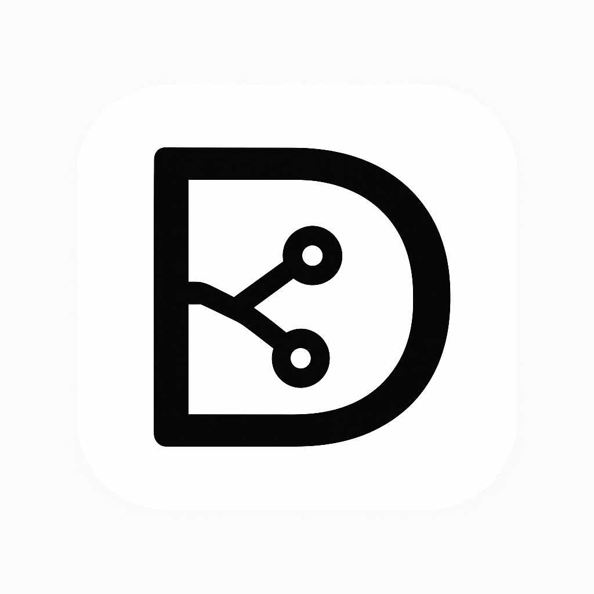

# DoContrib

<div align="center">



**開源的團隊貢獻追蹤與協作文件管理平台**

[](https://opensource.org/licenses/MIT)
[](https://nextjs.org/)
[](https://www.typescriptlang.org/)
[](https://docontrib.vercel.app)

[線上 Demo](https://docontrib.vercel.app) · [回報問題](https://github.com/Paper1988/DoContrib/issues) · [聯絡我們](mailto:docontrib@gmail.com)

</div>

---

## 📖 專案介紹

DoContrib 是一個協作文件管理平台，讓團隊成員能夠即時共同編輯文件，並追蹤每位成員的貢獻度。透過整合 Liveblocks 即時協作技術與 Tiptap 富文本編輯器，提供流暢的多人同步編輯體驗。

### 核心功能

- **即時協作編輯** — 多人同時編輯同一文件，支援游標顯示與即時同步
- **貢獻度追蹤** — 記錄並統計每位成員的文字新增、刪除量與編輯次數
- **個人資料管理** — 支援 Markdown 格式的個人簡介編輯
- **Google OAuth 登入** — 使用 NextAuth.js 整合 Google 登入
- **深色 / 淺色主題** — 支援系統主題自動切換

---

## 🛠 技術棧

| 類別 | 技術 |
|------|------|
| **前端框架** | Next.js 16 (App Router) |
| **語言** | TypeScript |
| **樣式** | Tailwind CSS v4、MUI v7 |
| **編輯器** | Tiptap v3 + Liveblocks YJS |
| **即時協作** | Liveblocks v3、Supabase Realtime |
| **認證** | NextAuth.js v4 (Google OAuth) |
| **資料庫** | Supabase (PostgreSQL) |
| **動畫** | Framer Motion |
| **HTTP Client** | Axios |
| **部署** | Vercel |

---

## 🚀 快速開始

### 環境需求

- Node.js 20+
- Yarn 4+

### 安裝步驟

**1. Clone 專案**

```bash
git clone https://github.com/Paper1988/DoContrib.git
cd DoContrib
```

**2. 安裝依賴**

```bash
yarn install
```

**3. 設定環境變數**

複製 `.env.example` 並填入設定值：

```bash
cp .env.example .env.local
```

```env
# Supabase
NEXT_PUBLIC_SUPABASE_URL=your_supabase_url
NEXT_PUBLIC_SUPABASE_ANON_KEY=your_supabase_anon_key
SUPABASE_SERVICE_ROLE_KEY=your_supabase_service_role_key

# NextAuth
NEXTAUTH_SECRET=your_nextauth_secret
NEXTAUTH_URL=http://localhost:3000

# Google OAuth
GOOGLE_CLIENT_ID=your_google_client_id
GOOGLE_CLIENT_SECRET=your_google_client_secret

# Liveblocks
NEXT_PUBLIC_LIVEBLOCKS_PUBLIC_KEY=your_liveblocks_public_key
LIVEBLOCKS_SECRET=your_liveblocks_secret
```

**4. 啟動開發伺服器**

```bash
yarn dev
```

開啟 [http://localhost:3000](http://localhost:3000) 即可看到結果。

### Docker 啟動

```bash
docker compose up
```

---

## 📁 專案結構

```
DoContrib/
├── app/                        # Next.js App Router 頁面
│   ├── api/                    # API Route Handlers
│   │   ├── auth/               # NextAuth 認證
│   │   ├── contributions/      # 貢獻度 API
│   │   ├── documents/          # 文件 CRUD API
│   │   ├── liveblocks-auth/    # Liveblocks 認證端點
│   │   ├── profile/            # 個人資料 API
│   │   └── users/              # 使用者查詢 API
│   ├── documents/              # 文件列表與編輯頁
│   ├── user/                   # 個人資料與儀表板
│   ├── layout.tsx              # 根版面配置
│   └── page.tsx                # 首頁
├── components/                 # React 元件
│   ├── CollaborativeEditor.tsx # 協作編輯器主元件
│   ├── MenuBar.tsx             # 編輯器工具列
│   ├── OnlineUsersList.tsx     # 線上使用者清單
│   ├── navigation/             # 導覽列元件
│   └── ui/                     # UI 基礎元件 (shadcn/ui)
├── hooks/                      # 自訂 React Hooks
│   ├── useDocumentSync.ts      # 文件即時同步
│   ├── useRealtimePresence.ts  # 即時在線狀態
│   └── useTiptapEditor.ts      # Tiptap 編輯器初始化
├── lib/                        # 工具函式與設定
│   ├── auth.ts                 # NextAuth 設定
│   ├── auth-utils.ts           # 伺服器端認證工具
│   ├── api.ts                  # Axios 實例
│   └── supabase/               # Supabase 客戶端
└── types/                      # TypeScript 型別定義
```

---

## 🗄 資料庫結構

### `users`
| 欄位 | 型別 | 說明 |
|------|------|------|
| `id` | UUID | 主鍵 |
| `name` | text | 使用者名稱 |
| `email` | text | 電子郵件 |
| `image` | text | 頭像 URL |
| `bio` | text | 個人簡介 (Markdown) |

### `documents`
| 欄位 | 型別 | 說明 |
|------|------|------|
| `id` | UUID | 主鍵 |
| `title` | text | 文件標題 |
| `content` | jsonb | Tiptap JSON 內容 |
| `owner_id` | UUID | 擁有者 (FK → users) |
| `updated_at` | timestamptz | 最後更新時間 |

### `contributions`
| 欄位 | 型別 | 說明 |
|------|------|------|
| `id` | UUID | 主鍵 |
| `document_id` | UUID | 文件 (FK → documents) |
| `user_id` | UUID | 使用者 (FK → users) |
| `words_added` | integer | 新增字數 |
| `words_deleted` | integer | 刪除字數 |
| `edit_sessions` | integer | 編輯次數 |
| `total_time_spent` | integer | 總編輯時長 (秒) |
| `last_contribution` | timestamptz | 最後貢獻時間 |

---

## 🔌 API 端點

### 文件

| 方法 | 路徑 | 說明 |
|------|------|------|
| `GET` | `/api/documents` | 取得目前使用者的所有文件 |
| `POST` | `/api/documents` | 建立新文件 |
| `GET` | `/api/documents/[id]` | 取得單一文件 |
| `PATCH` | `/api/documents/[id]` | 更新文件標題或內容 |
| `DELETE` | `/api/documents/[id]` | 刪除文件 |

### 貢獻度

| 方法 | 路徑 | 說明 |
|------|------|------|
| `POST` | `/api/contributions` | 新增 / 更新貢獻記錄 |
| `GET` | `/api/documents/[id]/contributions` | 取得文件的貢獻統計 |

### 使用者與認證

| 方法 | 路徑 | 說明 |
|------|------|------|
| `GET` | `/api/users` | 查詢使用者列表 |
| `GET` | `/api/profile/[userId]` | 取得個人資料 |
| `POST` | `/api/profile/[userId]` | 更新個人簡介 |
| `POST` | `/api/liveblocks-auth` | 取得 Liveblocks 認證 Token |

---

## 🤝 貢獻指南

歡迎提交 PR 或回報 Issue！

1. Fork 本專案
2. 建立功能分支：`git checkout -b feature/your-feature`
3. 提交變更：`git commit -m 'feat: 新增某功能'`
4. 推送分支：`git push origin feature/your-feature`
5. 開啟 Pull Request

---

## 📋 開發計畫

請參閱 [TODO.md](./TODO.md) 了解目前的開發進度與未來計畫。

**Stage I** — 核心功能（進行中）
- [x] Liveblocks 認證端點
- [x] Tiptap + Liveblocks 協作編輯整合
- [ ] 完整貢獻度追蹤邏輯

**Stage II** — 使用者與群組管理（規劃中）
- [ ] 群組建立與管理
- [ ] 邀請成員功能
- [ ] 文件權限控管

**Stage III** — 優化與擴充（未來）
- [ ] 即時在線成員顯示
- [ ] 詳細貢獻報告
- [ ] 錯誤處理與使用者回饋

---

## 👥 貢獻者

- [Paper1988](https://github.com/Paper1988)
- [Njdgee](https://github.com/Njdgee)

---

## 📄 授權

本專案採用 [MIT License](./LICENSE) 授權。

---

<div align="center">

Made with ❤️ in Taiwan

[回到頂部](#docontrib)

</div>
